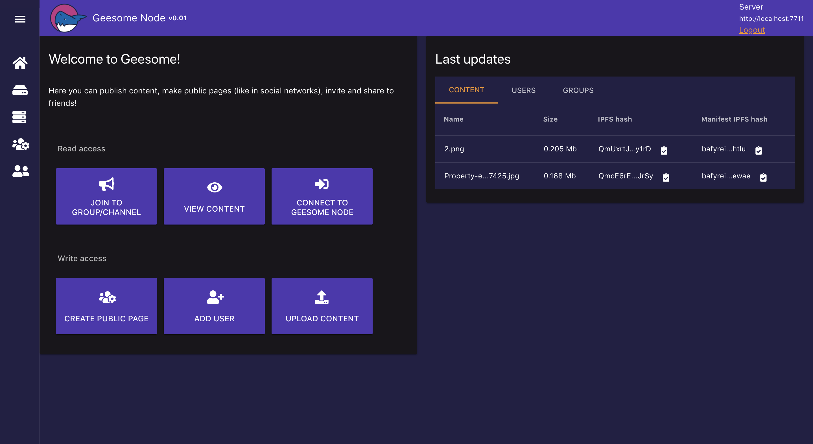
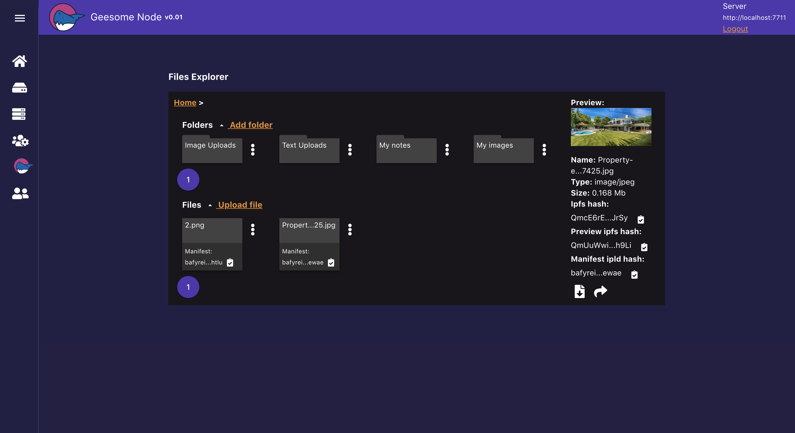

<h1 align="center">
  </a>
</h1>

<h3 align="center">File Storage and Social Media Node</h3>
<div align="center">
  Current state: 0.2.0 - Alpha
</div>

<br />

<div align="center">


</div>
<br/>
<br/>
<div align="center">
  
  <a href="https://t.me/geesome"></a>
</div>
<br/>

# GeeSome Node
GeeSome Node allows you to run your own file storage with social media functional: 
make you own public or private group with posts and content.
It's a Node on top of IPFS for define and manage data structure of files, users and groups.
Node provides a UI for storing and accessing your saved data or remote data of other nodes: files, posts, groups.



## About GeeSome Project
GeeSome protocol created to provide communication tool between communities of property owners in Galt Project. 

Galt Project team is aware of many cases of censorship and blocking in different social networks. These cases forced us to develop a new decentralized protocol and node application that would allow anyone to upload any content to his personal node and to share this content with the whole world without the risk of being blocked.

Using the GeeSome protocol, communities in the Galt Project will be able to communicate in encrypted chat groups, share images, video, text or any data.

We are sure that this tool should be used not only by the project's communities, but also by anyone who is concerned about the safety of their data, censorship and blocking in web.

## GeeSome Protocol
A new open protocol for unstopable social networking and communication on IPFS.
It defines the structure of social network data to describe familiar to the modern user entities: content, posts, tags, groups.

## Summary
With the help of GeeSome Node, anyone can create an instance of a decentralized social network, with groups like in YouTube, Instagram or Telegram but with content preservation and no locks or censorship thanks to the concept of personal GeeSome Node using IPFS Node to store content, access data and receive updates by libp2p.

GeeSome Node can be used:
- to create and maintain your blog
- to save important content like Saved messages in telegrams and / or in the form of a file structure as in Google Drive
- as a media platform for adding and viewing / listening to audio and video content, creating playlists
- to share the uploaded content in any form (blog, playlist, file, folder)
- to create chat groups

## GeeSome Scheme


You can run personal or public GeeSome node. It used for storing files, manage entities and prepare content for publishing.
Also because of IPNS updates issues - GeeSome node have IPNS caching based on signed PubSub events.

## UI Screenshots

### File explorer


### Test group


### Mobile version
| Main page | Menu | Groups list | Group page |
| --- | --- | --- | --- |
|  |  |  |  |

## Install with domain to your server
1. Set DNS settings for domain: ip address of server
2. Clone repo to server that bound to domain
```
git clone https://github.com/galtspace/geesome-node.git
```
3. Run script with parameters: domain and email for letsencrypt
```
cd geesome-node
export DOMAIN="your-site.com" EMAIL="info@your-site.com"; ./bash/full-install.sh 
```
There is additional parameters that can be used in export:

| Parameter | Description |
|-----|-------------|
| DATABASE_NAME | Database name to store app data. Default: ~/.jsipfs |
| STORAGE_REPO | Directory to store IPFS content  |

4. Open your-site.com/#/setup and create first admin user

## Getting started with GeeSome Node API
1. Get apiKey from GeeSome UI of your node
```
You can get your current session api key after login by enter localStorage.getItem('geesome-api-key') in browser console of UI page. Soon it will be more convenient and correct by keys generation in UI.
```
2. Install GeeSome libs by npm:
```
npm i --save git://github.com/galtspace/geesome-libs.git
```
or yarn:
```
yarn add git://github.com/galtspace/geesome-libs.git
```
3. Init GeeSome client and send request to your GeeSome node
```
const { GeesomeClient } = require('geesome-libs/src/GeesomeClient');

const geesomeClient = new GeesomeClient({
    server: 'https://your-site.com:7722',
    // paste apiKey from GeeSome UI here
    apiKey: '4J1VYKW-ZP34Y0W-PREH1Q2-DYN9Q8E'
});
await geesomeClient.init();

const contentObj = await geesomeClient.saveDataByUrl('http://url.to/image.jpg');

console.log('content ipfs', contentObj.storageId);
console.log('content manifest ipld', contentObj.manifestStorageId);
```
You can also use `geesomeClient.loginUserPass` for login via login and password without manually 
setting `apiKey`. But more safer to use `apiKey`, because you can always disable it `apiKey` and 
create another if there is a leak.

## TODO:
- Manage api keys in UI
- Share folder by ipld manifest
- Share folder by ipns manifest
- Play audio and video content in groups as playlist
- Public chat groups
- Personal messages
- Private chat groups
- Feed for aggregate channels, chats, personal messages like in Telegram
- Local IPNS accounts (in-browser) and signing authentication or publish transactions

## Minimal requirements
- System: Ubuntu 16.04
- 2 GB RAM
- 1 GB free HDD + space for your files

## Dependencies
- Node 10.x
- Mysql Server 5.7
- ffmpeg
- Cerbot(Letsencrypt)

## Links
- [Manifests example](./docs/manifests-example.md)
- [API](./components/api/http-v1/index.ts)
- [Libs repo](https://github.com/galtspace/geesome-libs)

## Do you like the project? ✨
Put a star and fork it. Join Us On [Telegram](https://t.me/geesome). Thank you!
